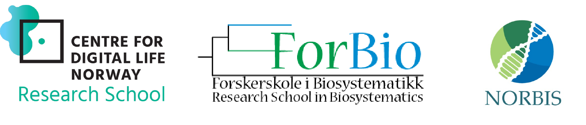

# Bioinformatics for Environmental Sequencing (DNA metabarcoding)
**These pages contain course material for BIO9905MERG1 Spring 2023**  
For the course page on the University of Oslo [webpage, click here](https://www.uio.no/studier/emner/matnat/ibv/BIO9905MERG1/).

## Course content
For mapping and exploring communities of both micro- and macroorganisms, high throughput sequencing (HTS) of environmental DNA has become a powerful approach. One can either analyze the total DNA content to obtain knowledge about which genes are present (DNA metagenomics) or sequence a selected PCR-amplified marker (DNA metabarcoding) to obtain information about the taxonomic composition. We will focus on the latter approach in this course. The students will be introduced to important analytical bioinformatics approaches from the processing of raw sequence data to establishment of the OTU/sample matrix and retrieval of taxonomic identity of the sequences.

Important themes will be (1) filtering and quality assessment of high throughput sequence data, (2) error correction and/or clustering of high throughput sequence data, and (3) taxonomic annotation of high throughput sequence data. We will also touch upon some further downstream analyses, including network analyses and evolutionary placement of HTS onto backbone phylogenies. Applications of a wide suite of tools will be presented, including VSEARCH and DADA2.

The course will be a blend of presentations, guest lectures, discussion and a few hands-on sessions. All hands-on secession will be run in R on your local laptop/computer. Hence, all participants should have R and selected R packages installed – see information below.

## Schedule

The course will run from 17-21 April, 9:00-17:00 (times may vary). For a detailed overview of the program, see below.

## Report
Those of you that attend the course through the research schools or UiO and want to obtain ECTS credits, will have to hand in a report before June 1th.
For the report, you should write a 4-page text (minimum) about a fictive research project where you will use DNA-metabarcoding to explore the community composition and diversity of a certain habitat and/or ecological gradient. You are free to select the organismal group(s) and the habitat/gradient. In the text you should: (1) define the goal(s) of the study, (2) describe the sampling design, (3) the wet-lab work (briefly) and, most important, (4) the bioinformatics analyses. Not only describe how you plan to carry out the research, but also why you make your choices. On point (4), describe in detail how you plan to analyze your data and which bioinformatics approaches you will use and why. Also mentioned what you expect to be problematic and which steps that might introduce bias(es) to your results, as well as what type of bias(es). Concerning the format, you should use Times New Roman size 12, 1.5 line spacing and 2.5 cm margins.

The report should be sent to: haavarka@ibv.uio.no

## Teachers
The main teachers will be Ramiro Logares, Anders K. Krabberød, Micah Dunthorn, Torbjørn Rognes, Frédéric Mahé and Håvard Kauserud (organizer), but other experts will provide guest lectures (see table).

## Program

| Day           | Time (start) | Topic                                                                                                            | Responsible                   |
| ------------- | ------------ | ---------------------------------------------------------------------------------------------------------------- | ----------------------------- |
| **Monday**    | 09:00        | [Introduction to DNA metabarcoding](./Lectures/Lecture_pdfs/Intro_lecture.pdf)                                   | Håvard Kauserud               |
|               | 10:00        | *Introduction continued*                                                                                         |                               |
|               | 11:00        | [Introduction to sequencing techniques](./Lectures/Lecture_pdfs/20230417_Lyle_v2.pdf)                            | Robert Lyle                   |
|               | 12:00        | **Lunch break**                                                                                                  |                               |
|               | 13:00        | Group work                                                                                                       | Håvard Kauserud               |
|               | 14:00        | [Introduction to Linux, Google Colab and R ](./Lectures)                                                         | Ramiro Logares                |
|               | 15:00        | [Cutadapt and sequence cleaning](Lectures/cutadapt.and.seq.cleaning/)                                            |                               |
|               | 16:00        | [Help with setup and installation of required packages](./Setup)                                                 | Anders K. Krabberød           |
|               | 17:00        | **PIZZA**                                                                                                        |                               |
|               |              |                                                                                                                  |                               |
| **Tuesday**   | 09:00        | [Introduction to DADA2](Dada2_Pipeline)                                                                          | A. Krabberød / R. Logares     |
|               | 10:00        | *DADA2 continued*                                                                                                |                               |
|               | 11:00        | *DADA2 continued*                                                                                                |                               |
|               | 12:00        | **Lunch break**                                                                                                  |                               |
|               | 13:00        | *DADA2 continued*                                                                                                |                               |
|               | 14:00        | *DADA2 continued*                                                                                                |                               |
|               | 15:00        | [Community Ecology](./Lectures/community.ecology.intro/)                                                         | R. Logares                    |
|               | 16:00        | *Community Ecology*                                                                                              |                               |
|               |              |                                                                                                                  |                               |
| **Wednesday** | 09:00        | [Introduction to VSEARCH and Swarm](./Lectures/Vsearch_swarm/)                                                   | Torbjørn Rognes               |
|               | 10:00        | [from FASTQ files to OTU tables ](./Lectures/Vsearch_swarm/)                                                     | Frédéric Mahé                 |
|               | 11:00        | *continued*                                                                                                      |                               |
|               | 12:00        | **Lunch break**                                                                                                  |                               |
|               | 13:00        | [LULU and MUMU (C++ version of LULU)](./Lectures/Vsearch_swarm//)                                                | Frédéric Mahé                 |
|               | 14:00        | [Abundance estimation in DNA metabarcoding ](./Lectures/Estimating_abundance/)                                   | Douglas Yu (Zoom)             |
|               | 15:00        | Early end, social activities (TBA)                                                                               |                               |
|               | 18:00        | Social activities (TBA)                                                                                          |                               |
|               |              |                                                                                                                  |                               |
| **Thursday**  | 09:00        | [Phylogenetic placement/binning of HTS data](./Lectures/Lecture_pdfs/Lucas_Czeck_placement_share.pdf)            | Lucas Czech                   |
|               | 10:00        | [Introduction to long-read DNA metabarcoding](./Lectures/Lecture_pdfs/Jamy_Long-read_metabarcoding.pdf)          | Mahwash Jamy                  |
|               | 11:00        | *continued*                                                                                                      |                               |
|               | 12:00        | **Lunch break**                                                                                                  |                               |
|               | 13:00        | [OTUs, ASVs and phylospecies](./Lectures/Lecture_pdfs/dunthorn_clustering_talk_Oslo_2023.pdf)                    | Micah Dunthorn                |
|               | 14:00        | [Contamination, library prep, aerial metabarcoding](./Lectures/Lecture_pdfs/kbohmann_2023_reduced_file_size.pdf) | Kristine Bohmann (Zoom)       |
|               | 15:00        | *continued*                                                                                                      |                               |
|               | 16:00        | [LULU and MUMU (C++ version of LULU)](./Lectures/Vsearch_swarm/)                                                 | Frédéric Mahé                 |
|               |              |                                                                                                                  |                               |
| **Friday**    | 09:00        | [Taxonomic Assignment](./Lectures/Lecture_pdfs/Davey_metabarcoding_course_taxonomic_assignment_20042023.pdf)     | Marie Davey                   |
|               | 10:00        | [Case study (insect metabarcoding)](./Lectures/Lecture_pdfs/Davey_NorIns_Case_Study_20042023.pdf)                | Marie Davey                   |
|               | 11:00        | [Metacoder](./Lectures/Metacoder/)                                                                               | Ella Thoen                    |
|               | 12:00        | **Lunch break**                                                                                                  |                               |
|               | 13:00        | Downstream analyses: [Networks](./Lectures/Networks/)                                                            | Ramiro  and Anders            |
|               | 14:00        | Case studie on DNA metabarcoding                                                                                 | Sundy Maurice (guest lecture) |
|               | 15:00        | Summing up, QnA                                                                                                  |                               |

---
# Software
We will use R (version 4.0.5 or later) and Rstudio (version 1.4.1 or later) in this course. In addition, we will use Google Colab for programs that require a Linux/Unix environment.

**Everybody should download and install R (https://www.r-project.org/), Rstudio (https://www.rstudio.com/) and the required packages before the course starts**.

For more information about the required packages [click here](Setup/).

---

# Suggested reading (reviews)
You can find the PDFs as well as some more reading material under  [Suggested reading:](Suggested_reading/)
- Zinger et al. 2019. DNA metabarcoding—Need for robust experimental designs to draw sound ecological conclusions. Molecular Ecology, 28, 1857-1862
- Deiner et al. 2017. Environmental DNA metabarcoding: Transforming how we survey animal and plant communities. Molecular Ecology, 26, 5872-5895.
- Bohmann et al. 2014. Environmental DNA for wildlife biology and biodiversity monitoring. TREE, 29.
- Alberdi et al. 2017. Scrutinizing key steps for reliable metabarcoding of environmental samples. Methods in Ecology and Evolution, 9, 134-147.
- Ficetola et al. 2016. How to limit false positives in environmental DNA and metabarcoding? Molecular Ecology, 16, 604-607.
- Dickie et al. 2018. Towards robust and repeatable sampling methods in eDNA-based studies. Molecular Ecology Resources, 18, 940-952.
- Schnell et al. 2015. Tag jumps illuminated – reducing sequence‐to‐sample misidentifications in metabarcoding studies. Molecular Ecology Resources, 15, 1289-1303.
- Antich et al. 2021. To denoise or to cluster, that is not the question: optimizing pipelines for COI metabarcoding and metaphylogeography. BMC Bioinformatics, 22,177.
- Lamb et al. 2019. How quantitative is metabarcoding: A meta‐analytical approach. Molecular Ecology, 28, 420-430.
 -Jamy et al. 2019. Long-read metabarcoding of the eukaryotic rDNA operon to phylogenetically and taxonomically resolve environmental diversity. Molecular Ecology Resources, 20, 429-443.
 ----
 # Class of 2023
 
 ----
### Supported by [Digitalt Liv Norge](https://www.digitallifenorway.org/), [ForBio](https://www.forbio.uio.no/), and [Norbis](https://norbis.w.uib.no/)
  
  
All the keywords in this explanation, by the way, are totally misleading, due to the everyday quirks of language. **Don DeLillo, Ratner's Star**.

---
